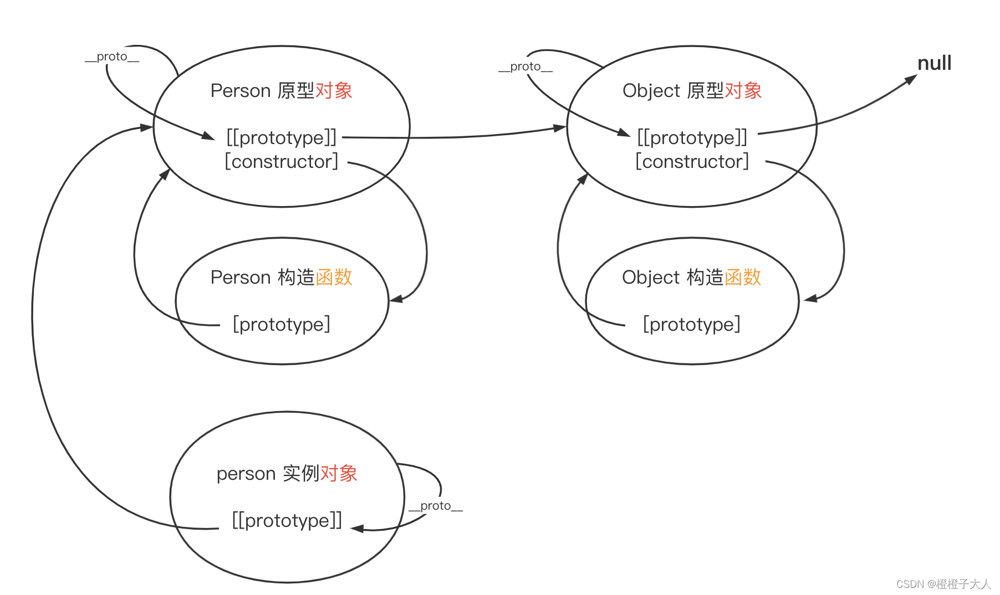
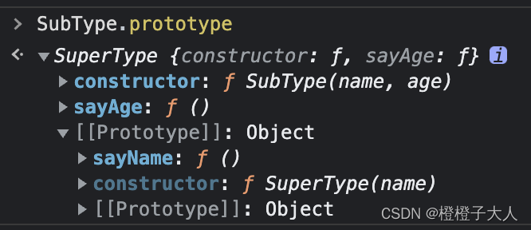

本文内容：
* 理解对象
* 理解对象创建过程
* 理解构造函数、原型对象和实例之间的关系
* 理解继承
## 对象基本

### 创建对象
```js
// 构造实例方式
const person = new Object();
person.name = 'a';

// 声明式
const person = {
	name: 'a'
};
```
### 对象属性
为了标识某个标识为内部特性，ECMA-262 使用两个中括号把特性名称括起来。

**数据属性**

* [[Configurable]]
	* 属性是否可被 delete 
	* 是否可修改以下特性
	* 是否可以将其改为访问器属性
	* 默认为 true
* [[Enumerable]]
	* 是否可被 for...in... 检索到
	* 默认为 true
* [[Writable]]
	* 是否可被修改
	* 默认为 true
* [[Value]]
	* 属性实际的值
	* 默认为 undefined

**修改数据属性**

`Object.defineProperty()`，该方法接收3个参数：`目标对象`、`属性名称` 和 `描述符对象`。

```js
const person = {};
Object.defineProperty(person, 'name', {
	writable: false,
	value: 'aa'
});
```
本例使用 `Object.defineProperty()` 给 person 创建了一个属性 `name`，在非严格模式下给这个属性重新赋值会被忽略；在严格模式下，尝试修改只读属性则会报错。

当一个属性被定义为不可配置后，就不能再变回可配置的了。此时调用 `Object.defineProperty()` 并修改任何非 `writable` 属性都会导致错误。

在使用 `Object.defineProperty()` 时，如果不在第三个参数提供 `configurable`、`enumerable` 和 `writable`。

**访问器属性**

* [[Configurable]]
	* 是否可以被 delete 并重新定义
	* 是否可以修改本属性的特性
	* 是否可以改为数据属性
	* 默认为 true
* [[Enumerable]]
	* 是否能被 for...in... 检索到
	* 默认为 true
* [[Get]]
	* 获取函数
	* 在读取属性时调用，默认为 undefined
* [[Set]]
	* 设置函数
	* 在写入属性时调用，默认为 undefined

```js
const book = {
	year_: 2022,
	edition: 1
};

Object.defineProperty(book, 'year_', {
	get() {
		return this.year_;
	}
	set(v) {
		if (v > this.year_) {
			this.year_ = v;
			this.edition += v - 2022;
		}
	}
});
```

获取函数和设置函数不是必须设置的，只设置获取函数说明这个属性是只读的。在非严格模式下，给只读属性赋值会被忽略；在严格模式下则会报错。

**同时定义多个属性**

`Object.defineProperties()`

```js
const book = {};
Object.defineProperties(book, {
	year_: {
		value: 2022
	},
	edition: {
		value: 1
	},
	year: {
		get() {
			return this.year_;
		}
		set(v) {
			if (v > 2022) {
				this.year_ = v;
				this.edition += v - 2022;
			}
		}
	},
});
```

**读取属性的特性**

`Object.getOwnPropertyDescriptor()`

这个方法接收两个参数：`目标对象` 和 `目标属性名`。

```js
const book = {};
// 这里调用上文所示的对 book 的属性定义
// ...

const descriptor = Object.getOwnPropertyDescriptor(book, 'year');

console.log(descriptor.value); // undefined
console.log(descriptor.enumerable); // false
console.log(typeof descriptor.get); // "function"
```

提问：为什么这里的 enumerable 是 false ？(答案在“修改数据属性“一节)

**同时获取目标对象的所有属性的特征**

`Object.getOwnPropertyDescriptors()`

该静态方法是在 ES2017 处新增的，只接收 `目标对象` 一个参数。

```js
const book = {};
// 这里调用上文所示的对 book 的属性定义
// ...

console.log(Object.getOwnPropertyDescriptors(book));
/*
{
	edition: {
		configurable: false,
		enumerable: false,
		value: 1,
		writable: false
	},
	year: {
		configurable: false,
		enumerable: false,
		get: f(),
		set: f(v),
	},
	year_: {
		configurable: false,
		enumerable: false,
		value: 2022,
		writable: false
	},
}
*/
```

### 合并对象

`Object.assign()`

这个方法接收一个 `目标对象` 和 `一个或多个源对象`。

* 寻找源对象上符合条件的属性并将其复制到目标对象
	* 可枚举 Object.propertyIsEnumerable() 返回 true
	* 自有 Object.hasOwnProperty() 返回 true
* 以字符串和符号为键的属性会被复制
* 对每个符合条件的属性
  1. 使用源对象的 [[Get]] 获取属性值
  2. 使用目标对象的 [[Set]] 设置属性值

Object.assign() 执行的是浅复制。如果多个源对象有相同的属性，则会用最后(书写顺序最靠右或最靠下)一个复制的值。

Object.assign() 会返回目标对象的引用。

```js
const dest = {};

const res = Object.assign(dest, { id: 1, name: 'a' }, { id: 2 });

console.log(res === dest); // true
console.log(res); // { id: 2, name: 'a' }
```

如果在复制期间出错，则操作会中止并退出，同时抛出错误。此时 Object.assign() 只完成了部分复制，而这部分复制并不会回滚到原样。因此 Object.assign() 只是一个尽力而为的操作。

### 对象表示和相等判定
在 ES6 以前一些棘手的情况
```js
// === 符合预期的情况
console.log(true === 1); // false
console.log({} === {}); // false
console.log("2" === 2); // false

// 在不同的 JS 引擎中表现不同，但仍被认为相等
console.log(+0 === -0); // true
console.log(+0 === 0); // true
console.log(-0 === 0); // true

// 必须使用 isNaN() 来判定一个变量是否为 NaN
console.log(NaN === NaN); // false
console.log(isNaN(NaN)); // true
```

`Object.is()` 一定程度改善了上述棘手的情况。

```js
console.log(Object.is(true, 1)); // false
console.log(Object.is({}, {})); // false
console.log(Object.is("2", 2)); // false

console.log(Object.is(+0, -0)); // false
console.log(Object.is(+0, 0)); // true
console.log(Object.is(-0, 0)); // false

console.log(Object.is(NaN, NaN)); // true
```

### ES6 增强对象语法
**简写属性值**
```js
const name = 'aa';
const person = { name };
console.log(person.name); // "aa"
```

**动态命名属性**
```js
const nameKey = 'name';
const person = { [nameKey]: 'aa' };
console.log(person); // { name: 'aa' }
```
在 [ ] 内可以写任何 JS 表达式，比如说函数执行。

**简写方法名**
```js
const functionKey = 'sayAge';
const person = {
	sayName() {
		console.log('aa');
	}
	[functionKey]() {
		console.log(18);
	}
};
```
**对象解构**
```js
const person = {
	name: 'aa',
	age: 18
};

const {
	nane,
	age: personAge,
	some,
	hasDefault = 'default' // 不存在于源对象时使用默认值
} = person;

console.log(name); // "aa"
console.log(personAge); // 18
console.log(some); // undefined
console.log(hasDefault); // "default"
console.log(age); // Referrence Error
```
解构会在内部使用函数 `ToObject()` ( 不能在运行时环境中直接访问 ) 把元数据解构转换为对象。这意味着在对象解构的上下文中，原始值会被当成对象，而 `null`  和 `undefined` 不能被解构，否则会抛出错误。

```js
const { length } = 'fooBar';
console.log(length); // 6

const { constructor: c } = 4;
console.log(c === Number); // true

let { _ } = null; // TypeError
let { - } = undefined; // TypeError
```

基于以上认识，再来看一下 `嵌套解构`

```js
const person = {
	info: {
		name: 'aa',
		age: 18
	},
};

const { info: { name, age: personAge } } = person;
console.log(name); // "aa"
console.log(age); // 18

// 当我们从一个 undefind(人为或本身没有这个属性) 或 一个 null 的属性中解构时就会报错
const { job: { desc } } = person; // TypeError
```
我们也可以利用对象解构这个特性给其他对象赋值
```js
const person = {
	info: {
		name: 'aa',
		age: 18
	},
};
const copy = {};

{
	info: {
		name: copy.name,
		age: copy.age
	}
} = person;

console.log(copy); // { name: "aa", age: 18 }
```
此时，和 Object.assign() 类似，当解构赋值的过程中如果出现异常，这个过程是不能回滚的，就会出现部分赋值的情况。

**函数参数使用解构**
```js
const person = {
	name: 'aa',
	age: 18
};

function print({ name, age: myAge }) {
	console.log(name, myAge);
}

print(person); // "aa" 18
```
---
## 构造函数、原型对象和实例

### 构造函数模式
构造函数和传统的工厂函数对比有以下区别
* 没有显示地创建对象 (使用 new 创建)
* 属性和方法直接赋值给 this
* 没有 return

使用 `new` 操作符时构造函数会执行以下操作：
1. 在内存中创建一个新对象
2. 这个新对象内部的 [[prototype]] 特性被赋值为构造函数的 prototype 属性
3. 构造函数内部的 this 被赋值给这个新对象 ( 即 this 指向新对象 )
4. 执行构造函数内部的代码 ( 给新对象添加属性 )
5. 如果构造函数返回非空对象，则返回该对象；否则返回刚创建的新对象 ( 最好不要返回自定义对象，否则这个构造函数就没有意义了 )

在实例化时，如果不想传参数，那么构造函数后面的括号可加可不加。
```js
const Person = function() {
	this.name = 'aa';
	this.sayName = function() {
		console.log(this.name);
	};
};

const person1 = new Person();
const person2 = new Person;

console.log(person1 instanceof Object); // true
console.log(person1 instanceof Person); // true
console.log(person2 instanceof Object); // true
console.log(person2 instanceof Person); // true
```

**需要注意的是**，构造函数也是函数，在调用一个函数而没有明确设置 this 的情况下，this 始终指向 Global 对象 ( 在浏览器中就是 window 对象 )。
```js
// 作为函数调用
Person('aa'); // 添加到 window 对象
window.sayName(); // "aa"

// 在另一个对象的作用域中调用
const o = new Object();
Person.call(o, 'aa');
o.sayName(); // "aa"
```
**构造函数的问题**

上面定义的属性在不同实例间是不共享的，如果要维护一些公共属性，使用上面的做法会非常不方便。

### 原型模式
每个函数都会创建一个 `prototype` 属性，这个属性是指向一个对象的指针，该对象就是这个函数的原型对象，其包含应该由特定引用类型的实例共享的属性和方法。

使用 `原型对象` 的好处是在上面定义的属性和方法可以被对象实例共享。

假设现有一个 `Person` 构造函数和一个 `person` 实例，它们和 `Object` 及其原型对象的关系如下：

从这个图可以看出

* `构造函数` 和 `原型对象` 是两个概念，它们有自己的方式彼此通信
* `对象` 上有一个隐藏属性 `[[prototype]]` 用于和自己的构造函数的原型对象进行通信，一般情况下是不能直接访问这个属性的，但是有的浏览器（ Firefox、Safari 和 Chrome 等 ）会暴露 `__proto__` 让开发者来访问 `[[prototype]]`
这也意味着我们不能在代码中直接使用 `__proto__`，因为如果代码运行在不支持 `__proto__` 的浏览器时，`__proto__` 的值就是 undefined
* Object 构造函数及其原型对象基本上是 JS 的源头了。像 `Number`、`String` 这些构造函数都继承自 `Object 原型对象`

**原型方法**
* `instanceof`  判定是否包含指定构造函数的原型
	```js
	console.log(person1 instanceof Person); // true
	console.log(person1 instanceof Object); // true
	console.log(Person.prototype instanceof Object); // true
  ```
* `isPrototypeOf()`
	```js
	console.log(Person.prototype.isPrototypeOf(person1)); // true
	```
* `Object.getPrototypeOf()`
	返回参数内部特性 [[Prototype]] 的值
	```js
	console.log(Object.getPrototypeOf(person1) === Person.prototype); // true
	
	console.log(Object.getPrototypeOf(person1).name); // aa
	```
* `Object.setPrototypeOf()`
	可以像实例的私有特性 [[Prototype]] 写入一个新值以重写一个对象的原型继承关系
	```js
	const biped = { numLegs: 2 };
	const person = { name: 'aa' };
	
	Object.setPrototypeOf(person, biped);
	
	console.log(person.name); // aa
	console.log(person.numLegs); // 2
	console.log(Object.getPrototypeOf(person) === biped); // true
	```
	**注意**，`Object.setPrototypeOf()` 可能会严重影响代码性能。Mozilla 文档说得很清楚，”在所有浏览器和 JS 引擎中，修改继承关系的影响都是微妙且深远的。这种影响并不仅是 Object.setPrototypeOf() 语句那么简单，而是会涉及所有访问了修改 [[Prototype]] 的对象的代码“。

	可以通过 `Object.create()` 来创建一个新对象同时为其指定原型来避免 `Object.setPrototypeOf()` 可能造成的性能下降。
	```js
	const biped = { numLegs: 2 };
	const person = Object.create(biped);
	person.name = 'aa';
	
	console.log(person.name); // aa
	console.log(person.numLegs); // 2
	console.log(Object.getPrototypeOf(person) === biped); // true
	```
* `Object.hasOwnProperty()`
	当属性存在于调用它的对象实例上时返回 true
	```js
	function Person() {
		this.name = 'aa';
	}
	Person.sayName = function() {
		console.log(this.name)
	};
	
	const p = new Person();
	console.log(p.hasOwnProperty('name')); // true
	console.log(p.hasOwnProperty('sayName')) // false
	```
### 遍历属性
* **in 操作符 —— 当属性存在于对象实例上或其原型链上时返回 true**
	* 单独使用 ( 常用于条件判断 )
	* for...in...
	可遍历实例属性和原型属性中所有可枚举的属性

* **Object.keys() —— 获得对象上所有可枚举的实例属性**

`for...in...` 和 `Object.keys()` 的枚举顺序是不确定的，取决于 JS 引擎，可能因浏览器而异。

**对象迭代**

* **Object.values()**
	```js
	const o = { foo: 'foo', bar: 1, baz: {} };
	console.log(Object.values(o)); // ["foo", 1, {}]
	
	console.log(Object.values(o)[2]); // true
	```
* **Object.entries()**
	```js
	const o = { foo: 'foo', bar: 1, baz: {} };
	console.log(Object.entries(o)); // [["foo", "foo"], ["bar", 1], ["baz", {}]]
	
	console.log(Object.entries[o][2][1] === o.baz); // true
	```

**特性**
* 这两个方法执行对象的浅复制
* 符号属性会被忽略

---

## 构造函数设计模式

### 盗用构造函数
**核心思路是在子类构造函数中调用父类构造函数**，在调用的时候可以向父类构造函数传参。

```js
function SuperType(name) {
	this.name = name;
}

function SubType() {
	// 继承 SuperType 并传参
	SuperType.call(this, 'aa');
	// 实例属性
	this.age = 18;
}

const instance = new SubType();
console.log(instance.name); // "aa"
console.log(instance.age); // 18
```

**盗用构造函数问题**

函数不能重用，因为方法必须在构造函数中定义。另外，子类不能访问父类原型上定义的方法，因此所有类型只能使用构造函数模式。

### 组合继承
**核心思路是使用原型链继承原型上的属性和方法，通过盗用构造函数继承实例属性**。

这样即可把方法定义在原型上实现重用，又可以让每个实例有自己的属性。

```js
function SuperType(name) {
	this.name = name;
}
function SubType(name, age) {
	// 继承属性
	SuperType.call(this, name);
	// 实例属性
	this.age = age;
}

// 继承方法
SubType.prototype = new SuperType();
// 在原型链上定义公共方法
SubType.prototype.sayAge = function() {
	console.log(this.age);
}

```

### 原型式继承
`Object.create()` 接收两个参数：作为新对象原型的对象和给新对象定义额外属性的对象(可选)。

第二个个参数数据格式和 `Object.defineProperties()` 的第二个参数一样。

```js
const person = {
	name: 'a',
	friends: ['b', 'c']
};

// person 是 anotherPerson 的原型
const anotherPerson = Object.create(person);
anotherPerson.name = 'hh';
anotherPerson.friends.push('gg');

// person 是 yetAnotherPerson 的原型
const yetAnotherPerson = Object.create(person, {
	name: {
		value: 'yetAnotherPerson'
	}
});
yetAnotherPerson.friends.push('hh');

console.log(person.friends); // "b, c, hh, gg"
console.log(yetAnotherPerson.name); // yetAnotherPerson
```

### 寄生式继承
核心思想是：创建一个实现继承的函数，以某种方式增强对象，然后返回这个对象。
```js
function createAnother(original) {
	const clone = Object.create(original); // 通过调用函数创建一个新对象
	clone.sayHi = function() { // 以某种方式增强这个对象
		console.log('hi');
	};
	return clone; // 返回这个对象
}

const person = { name: 'aa' };
const anotherPerson = createAnother(person);
anotherPerson.sayHi(); // "hi"
```

### 寄生式组合继承
```js
// 寄生式组合继承的基本模式
function inheritPrototype(subType, superType) {
	const prototype = Object.create(superType.prototype); // 创建对象
	prototype.constructor = subType; // 增强对象
	subType.prototype = prototype; // 赋值对象
}

// 使用
function SuperType(name) {
	this.name = name;
	this.colors = ['red', 'blue', 'green'];
}
SuperType.prototype.sayName = function() {
	console.log(this.name);
};

function SubType(name, age) {
	SuperType.call(this, name);
	this.age = age;
}

inheritPrototype(SubType, SuperType);

SubType.prototype.sayAge = function() {
	console.log(this.age);
};

console.log(SuperType.sayAge); // undefined

```
