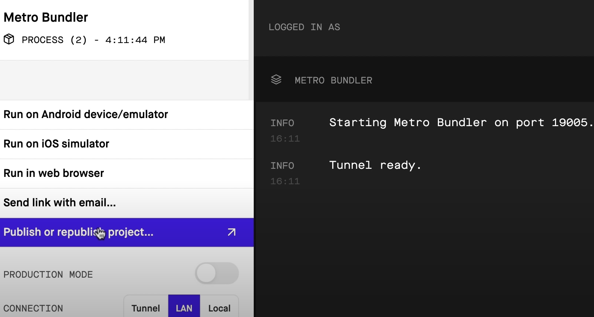
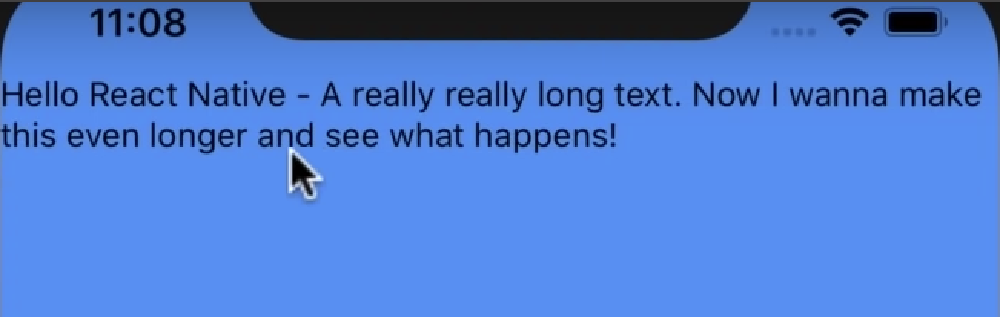
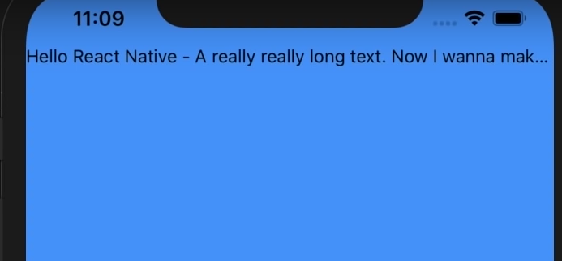
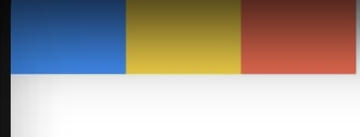
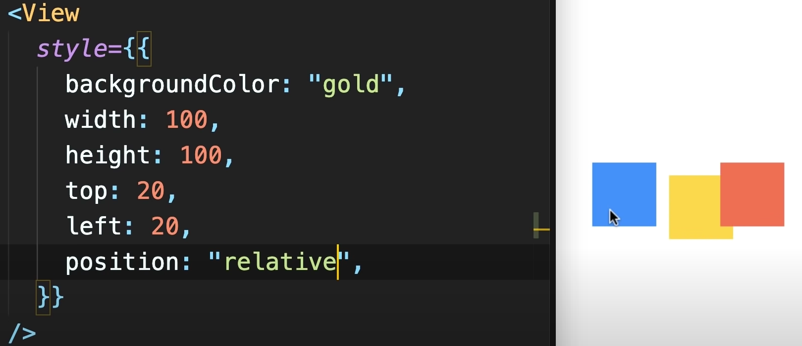
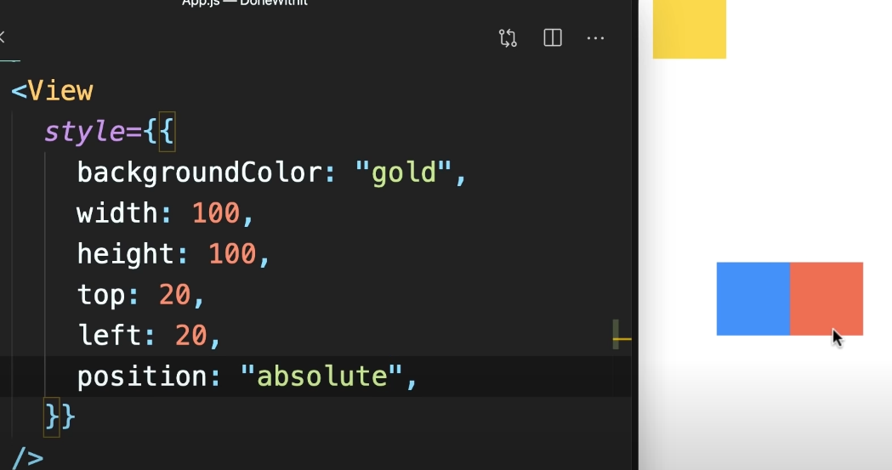

# 基本概念

## Start

通过脚手架创建

* Expo CLI
* React Native CLI


```shell
# 安装 expo
sudo npm i -g expo-cli

# 创建app
expo init myApp
# blank(TypeScript)
```

**目录**

* assets
* App.tsx


**启动项目**

```shell
npm start
```

进入一个可视化控制台




### ios

开发工具: `Xcode`

**1. 环境**

Preferrence ( 首选项 ) -> Locations -> Command Line Tools (确认是最新版)

**2. 打开模拟器**

XCode -> Open Developer Tool Simulator

**3. 在模拟器上跑本地应用**

在运行了 `npm start` 的控制台里按 i

**4. 控制台菜单**

Command D / Ctrl D + Command D


### android

开发工具: `android studio`

**1. 安装**

Standard -> Darcula / light

**2. 环境**

Configure -> SDK Manager -> 安装需要的 SDK 

```
Android x.x

Android SDK Build-Tools 30-rc2
Android Emulator
Android SDK Platform-Tools
intel x86 E,i;aypr Accelerator
```

**Mac / Linux**

mac 或者 linux 的开发者需要额外配置

https://docs.expo.io -> Android Studio Emulator

```shell
# Mac & Linux
vim ~/.bash_profile

# 添加以下内容
export ANDROID_SDK=/YourSDKLocation

# 找SDK配置地址
# 打开 Android Studio -> Configure -> SDK Manager
# 在打开页面顶部有个 Android SDK Location
# 复制机器的 SDK 位置并替换上面的 /YourSDKLocation

# Mac
vim ~/.bash_profile

# 添加以下内容
export PATH=/xxx/platform-tools:$PATH
# 用上面的 SDK 地址替换上面的 /xxx

# 安装了 zsh 的话
vim ~/.zshrc

# 复制上面两条 export 到此处
```

```shell
adb

# 如果执行这条命令出错了，说明上述配置错了
```

**3. 模拟器**

Android Studio -> Configure -> AVD Manager -> Create Virtual Device -> 选择模拟器 -> 安装镜像 -> 运行镜像

**4. 在模拟器上跑本地应用**

在运行了 `npm start` 的控制台里按 a

**5. 控制台菜单**

Command M / Ctrl M


### 真机

1. 在手机上安装 Expo
2. 在 Expo 可视化控制台上点击 Publish or republish project
3. 扫描出现的二维码

手机要和电脑连接同一 WiFi


---

## Debug

编译出错时模拟器会有完整的报错

### 在chrome上调试

1. 打开控制台菜单
2. Debug Remote JS (打开一个网页)
3. 在打开的网页上打开控制台，然后就和开发浏览器 web 端一样调试
4. 在调试完之后打开控制台菜单，关闭远程调试 (远程调试很吃资源(可能会卡)，记得关闭)


---

## Publish

在 expo 上发布       https://expo.io/@username/app

就像在 npm 上发布包

在 expo 上发布以后仅供下载测试，要发布到各应用市场还要看各应用市场上传规则


1. 在 expo 可视化控制台上发布

2. 命令行

   ```shell
   expo publish
   
   # 填写发布信息
   ```


---

# 基本组件

## View

```jsx
import { StyleSheet, Text, View, SafeAreaView } from 'react-native';

export default function App() {
  return (
  	<View>
    	<Text>Hello React Native</Text> <!-- 字跑到最左上角 (刘海左边的位置) -->
    </View>
  );
}

const style = StyleSheet.create({
  container: {
    flex: 1,
    backgroundColor: 'blue', // 整块屏幕的背景色，包括刘海屏上的刘海两边的空间
  }
});
```

**View & SafeAreaView**

View 的覆盖范围是整个手机的屏幕(包括刘海屏上的刘海两边的空间)

SafeAreaView 可以保证覆盖范围在刘海屏的刘海以下

```jsx
import { StyleSheet, Text, View, SafeAreaView } from 'react-native';

export default function App() {
  return (
  	<SafeAreaView style={styles.container}>
    	<Text>Hello React Native</Text> <!-- 字在刘海下面位置的最左上 -->
    </SafeAreaView>
  );
}

const styles = StyleSheet.create({
  container: {
    flex: 1,
    backgroundColor: 'blue',
  }
});
```

---

## Text

### 长文本省略

```jsx
import { StyleSheet, Text, View, SafeAreaView } from 'react-native';

export default function App() {
  return (
  	<SafeAreaView style={styles.container}>
    	<Text>
        Hello React Native - A really really long text. Now I wanna make this even longer and see what happens!
      </Text>
    </SafeAreaView>
  );
}

const styles = StyleSheet.create({
  container: {
    flex: 1,
    backgroundColor: 'blue',
  }
});
```



**长文本固定行数显示 (超出部分用省略号代替)**

```jsx
import { StyleSheet, Text, View, SafeAreaView } from 'react-native';

export default function App() {
  return (
  	<SafeAreaView style={styles.container}>
    	<Text numberOfLines={1}>
        Hello React Native - A really really long text. Now I wanna make this even longer and see what happens!
      </Text>
    </SafeAreaView>
  );
}

const styles = StyleSheet.create({
  container: {
    flex: 1,
    backgroundColor: 'blue',
  }
});
```




### 点击回调

`onPress`

```jsx
import { StyleSheet, Text, View, SafeAreaView } from 'react-native';

export default function App() {
  const handlePress = () => {
    console.log('Text pressed');
  };
  
  return (
  	<SafeAreaView style={styles.container}>
    	<Text numberOfLines={1} onPress={handlePress}>
        Hello React Native - A really really long text. Now I wanna make this even longer and see what happens!
      </Text>
    </SafeAreaView>
  );
}

const styles = StyleSheet.create({
  container: {
    flex: 1,
    backgroundColor: 'blue',
  }
});
```

---

## Image

```jsx
import { StyleSheet, Text, Image, SafeAreaView } from 'react-native';

export default function App() {
  console.log('./assets/icon.png'); // 2 (指向图片的键)
  
  return (
  	<SafeAreaView style={styles.container}>
    	<Text>Hello React Native</Text>
      <Image source={require('./assets/icon.png')} />
    </SafeAreaView>
  );
}

const styles = StyleSheet.create({
  container: {
    flex: 1,
    backgroundColor: 'blue',
    justifyContent: 'center',
    alignItems: 'center',
  }
});
```

引入的本地图片会被一起打包

```jsx
import { StyleSheet, Text, Image, SafeAreaView } from 'react-native';

export default function App() {
  return (
  	<SafeAreaView style={styles.container}>
    	<Text>Hello React Native</Text>
      <Image
        blurRadius={10} // 模糊程度
        fadeDuration={1000} // 渐入时间
        source={{
          width: 200,
          height: 200, // 引入网络图片时必须指定大小
          uri: 'https://picsum.photos/200/300'
        }}
       />
    </SafeAreaView>
  );
}

const styles = StyleSheet.create({
  container: {
    flex: 1,
    backgroundColor: 'blue',
    justifyContent: 'center',
    alignItems: 'center',
  }
});
```

引入本地图片不需要指定大小，因为 react-native 会读图片的数据

---

## Touchable

在 Text 组件中我们可以用 `onPress` 给组件加上回调，但有的组件，像 Image，是没有 `onPress` 这个属性的

这个时候可以用 Touchable 组件对天然不支持 `onPress` 的组件进行包装

**TouchableWithoutFeedback**

```jsx
import { StyleSheet, Text, TouchableWithoutFeedback, Image, SafeAreaView } from 'react-native';

export default function App() {
  const handlePress = () => {};
  
  return (
  	<SafeAreaView style={styles.container}>
    	<Text>Hello React Native</Text>
      <TouchableWithoutFeedback onPress={handlePress}>
      	<Image
          blurRadius={10} // 模糊程度
          fadeDuration={1000} // 渐入时间
          source={{
            width: 200,
            height: 200, // 引入网络图片时必须指定大小
            uri: 'https://picsum.photos/200/300'
          }}
       />
      </TouchableWithoutFeedback>
    </SafeAreaView>
  );
}

const styles = StyleSheet.create({
  container: {
    flex: 1,
    backgroundColor: 'blue',
    justifyContent: 'center',
    alignItems: 'center',
  }
});
```

**TouchableOpacity**

点击的时候会让图片变透明一下

```jsx
import { StyleSheet, Text, TouchableOpacity, Image, SafeAreaView } from 'react-native';

export default function App() {
  const handlePress = () => {};
  
  return (
  	<SafeAreaView style={styles.container}>
    	<Text>Hello React Native</Text>
      <TouchableOpacity onPress={handlePress}>
      	<Image
          blurRadius={10} // 模糊程度
          fadeDuration={1000} // 渐入时间
          source={{
            width: 200,
            height: 200, // 引入网络图片时必须指定大小
            uri: 'https://picsum.photos/200/300'
          }}
       />
      </TouchableOpacity>
    </SafeAreaView>
  );
}

const styles = StyleSheet.create({
  container: {
    flex: 1,
    backgroundColor: 'blue',
    justifyContent: 'center',
    alignItems: 'center',
  }
});
```

**TouchableHighlight**

点击的时候背景会变黑一下

```jsx
import { StyleSheet, Text, TouchableHighlight, Image, SafeAreaView } from 'react-native';

export default function App() {
  const handlePress = () => {};
  
  return (
  	<SafeAreaView style={styles.container}>
    	<Text>Hello React Native</Text>
      <TouchbaleHighlight onPress={handlePress}>
      	<Image
          blurRadius={10} // 模糊程度
          fadeDuration={1000} // 渐入时间
          source={{
            width: 200,
            height: 200, // 引入网络图片时必须指定大小
            uri: 'https://picsum.photos/200/300'
          }}
       />
      </TouchableHighlight>
    </SafeAreaView>
  );
}

const styles = StyleSheet.create({
  container: {
    flex: 1,
    backgroundColor: 'blue',
    justifyContent: 'center',
    alignItems: 'center',
  }
});
```

**TouchableNativeFeedback**

让元素有个向左右两边波动的效果

对图片不起作用，只对有背景颜色的元素起作用

Android only

```jsx
import { StyleSheet, Text, TouchableNativeFeedback, Image, SafeAreaView } from 'react-native';

export default function App() {
  const handlePress = () => {};
  
  return (
  	<SafeAreaView style={styles.container}>
    	<Text>Hello React Native</Text>
      <TouchableNativeFeedback onPress={handlePress}>
        <View style={{ width: 200, height: 70, backgroundColor: 'blue' }}></View>
      </TouchableNativeFeedback>
    </SafeAreaView>
  );
}

const styles = StyleSheet.create({
  container: {
    flex: 1,
    backgroundColor: 'blue',
    justifyContent: 'center',
    alignItems: 'center',
  }
});
```

---

## Button

在 ios 和 android 的样式不一样

```jsx
import { StyleSheet, Button, SafeAreaView } from 'react-native';

export default function App() {
  const handlePress = () => {};
  
  return (
  	<SafeAreaView style={styles.container}>
      <Button
        color="orange" // android -> 背景颜色变橙 ios -> 字体颜色变橙
        title="Click"
        onPress={handlePress}
      />
    </SafeAreaView>
  );
}

const styles = StyleSheet.create({
  container: {
    flex: 1,
    backgroundColor: 'blue',
    justifyContent: 'center',
    alignItems: 'center',
  }
});
```

---

## Alert

```jsx
import { StyleSheet, Button, SafeAreaView } from 'react-native';

export default function App() {
  const handlePress = () => {
    alert('Button tapped'); // ios 和 android 的弹窗样式不同
  };
  
  return (
  	<SafeAreaView style={styles.container}>
      <Button
        color="orange" // android -> 背景颜色变橙 ios -> 字体颜色变橙
        title="Click"
        onPress={handlePress}
      />
    </SafeAreaView>
  );
}

const styles = StyleSheet.create({
  container: {
    flex: 1,
    backgroundColor: 'blue',
    justifyContent: 'center',
    alignItems: 'center',
  }
});
```

自定义弹窗 `Alert.alert()`

```jsx
import { StyleSheet, Button, Alert, SafeAreaView } from 'react-native';

export default function App() {
  const handlePress = () => {
    Alert.alert('My title', 'My message', [
      { text: 'Yes', onPress: () => console.log('Yes') },
      { text: 'No', onPress: () => console.log('No') },
    ]);
  };
  
  return (
  	<SafeAreaView style={styles.container}>
      <Button
        color="orange" // android -> 背景颜色变橙 ios -> 字体颜色变橙
        title="Click"
        onPress={handlePress}
      />
    </SafeAreaView>
  );
}

const styles = StyleSheet.create({
  container: {
    flex: 1,
    backgroundColor: 'blue',
    justifyContent: 'center',
    alignItems: 'center',
  }
});
```

获取用户输入的弹窗 `Alert.prompt()`

```jsx
import { StyleSheet, Button, Alert, SafeAreaView } from 'react-native';

export default function App() {
  const handlePress = () => {
    Alert.prompt('My title', 'My message', text => console.log(text)); // 输入框
  };
  
  return (
  	<SafeAreaView style={styles.container}>
      <Button
        color="orange" // android -> 背景颜色变橙 ios -> 字体颜色变橙
        title="Click"
        onPress={handlePress}
      />
    </SafeAreaView>
  );
}

const styles = StyleSheet.create({
  container: {
    flex: 1,
    backgroundColor: 'blue',
    justifyContent: 'center',
    alignItems: 'center',
  }
});
```

---

## StyleSheet

**行内样式**

```jsx
import { Button, SafeAreaView } from 'react-native';

export default function App() {
  return (
  	<SafeAreaView style={{ backgroundColor: 'orange' }}> <!-- 刘海屏那部分背景变橙 -->
      <Button title="Click" />
    </SafeAreaView>
  );
}

```

用纯 js 对象来定义样式

```jsx
import { Button, SafeAreaView } from 'react-native';

export default function App() {
  return (
  	<SafeAreaView style={containerStyle}> <!-- 刘海屏那部分背景变橙 -->
      <Button title="Click" />
    </SafeAreaView>
  );
}

const containerStyle = { backgroundColor: 'orange' };

```

利用 StyleSheet

```jsx
import { StyleSheet, Button, SafeAreaView } from 'react-native';

export default function App() {
  return (
  	<SafeAreaView style={styles.container}>
      <Button title="Click" />
    </SafeAreaView>
  );
}

const styles = StyleSheet.create({
  container: {
    flex: 1,
    backgroundColor: 'blue',
    justifyContent: 'center',
    alignItems: 'center',
  }
});
```

使用 `StyleSheet` 的原因

* 使用 `StyleSheet` 可以验证我们传入的 css 属性拼写是否正确 (拼写错误或传入错误属性会直接报错)
* react-native 内部优化

**使用多项样式**

```jsx
import { StyleSheet, Button, SafeAreaView } from 'react-native';

export default function App() {
  return (
  	<SafeAreaView style={[styles.container, containerStyle]}>
      <Button title="Click" />
    </SafeAreaView>
  );
}

const containerStyle = { backgroundColor: 'orange' };

const styles = StyleSheet.create({
  container: {
    flex: 1,
    backgroundColor: 'blue',
    justifyContent: 'center',
    alignItems: 'center',
  }
});
```

右边(后来居上)的样式会覆盖前面的

---

# Platform-specific

针对 ios 和 android 编写不同的代码

比如 SafeAreaView 只针对 ios 有效，对安卓来说元素还是会跑到刘海上

**Platform**

```jsx
import { StyleSheet, Button, SafeAreaView, StatusBar, Platform } from 'react-native';

export default function App() {
  return (
  	<SafeAreaView style={[styles.container, containerStyle]}>
      <Button title="Click" />
    </SafeAreaView>
  );
}

const containerStyle = { backgroundColor: 'orange' };

const styles = StyleSheet.create({
  container: {
    flex: 1,
    backgroundColor: 'blue',
    paddingTop: Platform.OS === 'android' ? StatusBar.currentHight : 0,
  }
});
```

StatusBar.currentHight -> 刘海的高度

Platform.OS

* android
* ios
* macos
* web
* windows

---

# Layouts

density independent pixels ( dips ) —— 密度无关像素
$$
Physical Pixels = DIPs × Scale Factor
$$
eg.

```  
iphone 4/4s

Points   320 × 480 (抽象单位，并非像素)
Scale Factor   2x (每个 Point 包含2像素)
Pixels   640 × 960 (实际像素)
View Width   如果我们设置了150，那实际的像素是 150 × 2 = 300
```

```
iphone 11 Pro Max

Points   414 × 896 (抽象单位，并非像素)
Scale Factor   3x (每个 Point 包含2像素)
Pixels   1242 × 2688 (实际像素)
View Width   如果我们设置了150，那实际的像素是 150 × 3 = 450
```

为了达到样式的统一，最好使用百分比


## Dimensions

用于获取设备屏幕信息

```jsx
import { StyleSheet, Button, SafeAreaView, Dimensions, StatusBar, Platform } from 'react-native';

export default function App() {
  console.log(Dimensions.get('screen'));
  /*
  	Object {
  		"fontScale": 1,
  		"height": 896,
  		"scale": 3,
  		"width": 414
  	}
  */
  
  return (
  	<SafeAreaView style={styles.container}>
      <Button title="Click" />
    </SafeAreaView>
  );
}

const styles = StyleSheet.create({
  container: {
    flex: 1,
    backgroundColor: 'blue',
    paddingTop: Platform.OS === 'android' ? StatusBar.currentHight : 0,
  }
});
```

需要注意的是这个数据不会随着设备翻转而更新 (竖屏和横屏)


**检测竖屏/横屏**

在模拟器上按 command ← / → 来翻转屏幕

`app.json`

```json
{
  "orientation": "portrait" // 仅支持竖屏
}

{
  "orientation": "landscape" // 仅支持横屏
}

{
  "orientation": "default" // 支持两种模式
}
```

这里引入一个库

```shell
yarn add @react-native-community/hooks
```

```jsx
import { StyleSheet, Button, SafeAreaView, Platform } from 'react-native';
import { useDimensions } from '@react-native-community/hooks'; // 总是能拿到最新的屏幕数据

export default function App() {
  console.log(useDimensions());
  
  return (
  	<SafeAreaView style={styles.container}>
      <Button title="Click" />
    </SafeAreaView>
  );
}

const styles = StyleSheet.create({
  container: {
    flex: 1,
    backgroundColor: 'blue',
    paddingTop: Platform.OS === 'android' ? StatusBar.currentHight : 0,
  }
});
```

```jsx
import { StyleSheet, View, SafeAreaView, Platform } from 'react-native';
import { useDeviceOrientation } from '@react-native-community/hooks';

export default function App() {
  console.log(useDeviceOrientation()); // 总是拿到最新的屏幕翻转情况
  /*
  	Object {
  		"landscape": false,
  		"portrait": true
  	}
  */
  const { landScape } = useDeviceOrientation();
  
  return (
  	<SafeAreaView style={styles.container}>
      <View
      	style={{
          backgroundColor: 'blue',
          width: '100%',
          height: landscape ? '100%' : '30%'
        }}  
      ></View>
    </SafeAreaView>
  );
}

const styles = StyleSheet.create({
  container: {
    flex: 1,
    backgroundColor: 'blue',
    paddingTop: Platform.OS === 'android' ? StatusBar.currentHight : 0,
  }
});
```

---

## Flexbox

```jsx
import { View } from 'react-native';
import { useDeviceOrientation } from '@react-native-community/hooks';

export default function App() {
  return (
  	<View
      style={{
        backgroundColor: '#fff',
        flex: 1,
    	}}
    >
    	<View
        style={{
          backgroundColor: 'blue', // 整个画面都变成蓝色
          flex: 1,
        }}
       />
    </View>
  );
}

```

```jsx
import { View } from 'react-native';
import { useDeviceOrientation } from '@react-native-community/hooks';

export default function App() {
  return (
  	<View
      style={{
        backgroundColor: '#fff',
        flex: 1,
    	}}
    >
    	<View
        style={{
          backgroundColor: 'red', // 画面的上三分之一变成红色
          flex: 1,
        }}
       />
      <View
        style={{
          backgroundColor: 'green', // 画面中间三分之一变成绿色
          flex: 1,
        }}
       />
      <View
        style={{
          backgroundColor: 'blue', // 画面下面三分之一变成蓝色
          flex: 1,
        }}
       />
    </View>
  );
}


```

```jsx
import { View } from 'react-native';
import { useDeviceOrientation } from '@react-native-community/hooks';

export default function App() {
  return (
  	<View
      style={{
        backgroundColor: '#fff',
        flex: 1,
    	}}
    >
    	<View
        style={{
          backgroundColor: 'red', // 画面的上二分之一变成红色
          flex: 2,
        }}
       />
      <View
        style={{
          backgroundColor: 'green', // 画面中下四分之一变成绿色
          flex: 1,
        }}
       />
      <View
        style={{
          backgroundColor: 'blue', // 画面下四分之一变成蓝色
          flex: 1,
        }}
       />
    </View>
  );
}

```

**flexDirection**

```jsx
import { View } from 'react-native';
import { useDeviceOrientation } from '@react-native-community/hooks';

export default function App() {
  return (
  	<View
      style={{
        backgroundColor: '#fff',
        flex: 1,
    	}}
    >
    	<View
        style={{
          backgroundColor: 'blue',
          flex: 2,
          width: 100,
          height: 100
        }}
       />
      <View
        style={{
          backgroundColor: 'gold',
          flex: 1,
					width: 100,
          height: 100
        }}
       />
      <View
        style={{
          backgroundColor: 'tomato',
          flex: 1,
					width: 100,
          height: 100
        }}
       />
    </View>
  );
}

```


在 react-native 中默认从上往下排 (在 web 端通常是水平排)

**水平排**

`flexDirection`

```jsx
import { View } from 'react-native';
import { useDeviceOrientation } from '@react-native-community/hooks';

export default function App() {
  return (
  	<View
      style={{
        backgroundColor: '#fff',
        flex: 1,
        flexDirection: 'row'
    	}}
    >
    	<View
        style={{
          backgroundColor: 'blue',
          flex: 2,
          width: 100,
          height: 100
        }}
       />
      <View
        style={{
          backgroundColor: 'gold',
          flex: 1,
					width: 100,
          height: 100
        }}
       />
      <View
        style={{
          backgroundColor: 'tomato',
          flex: 1,
					width: 100,
          height: 100
        }}
       />
    </View>
  );
}

```




`row-reverse` 从右往左排

靠右上贴着 (从左到右依次是 红金蓝)

`column-reverse` 从下往上排

靠左下贴着 (从上到下依次是 红金蓝)


**justifyContent** ( main )

* flex-start ( default )
* flex-end
* space-around
* space-between
* space-evenly
* center

**alignItems** ( secondary ) ( flex 子元素在一行的副轴上的位置 )

在 flex 容器中设置

* center
* baseline
* flex-end
* flex-start
* stretch ( 副轴拉满 )

**alignSelf**

在 flex 容器中的元素里设置

值同 `alignItems`

**flexWrap**

当一行占不下同时需要换行时，在 flex 容器中设置

`flexWrap: 'wrap'`

**alignContent** ( 所有 flex 子元素在总副轴上的位置 )

值同 `alignItems`

**flexBasis**

设置在 flex 容器里的元素

指定 flex 元素的宽度或高度 \<number>

**flexGrow**

设置在 flex 容器里的元素

如果设置为1，那这个元素就会占满周围在主轴方向上的位置

`flex: 1` 达到相同效果

**flexShrink**

设置在 flex 容器里的元素

如果设置为1，则当当前元素在主轴上占比太大导致其他元素压缩时，让当前元素压缩直到其他元素能正常显示

`flex: -1` 达到相同效果

***如果样式不起作用，尝试一下手动刷新模拟器***

---

## position

对于 react-native 组件可以直接设置  `left`  `right`  `top`  `bottom`

因为 react-native 的组件默认设置为 `position: 'relative'`

可以手动将元素设置为 `position: 'absolute'`





