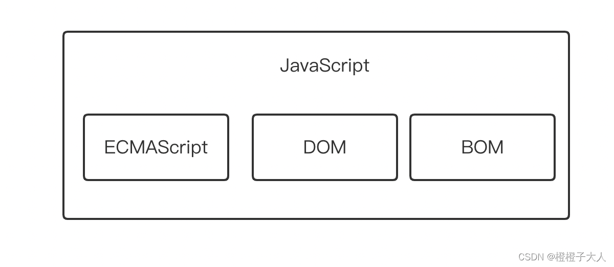
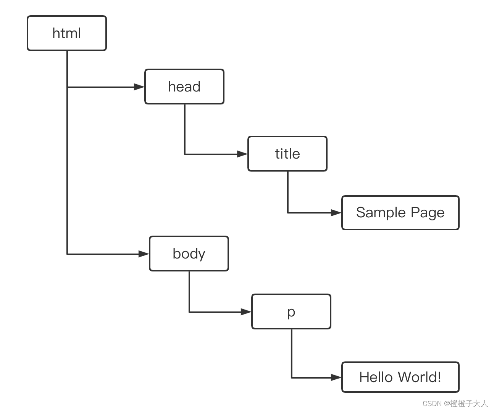

# JS  简史
1995年，JavaScript问世。在那个普遍通过电话拨号上网的年代，由哭护短处理某些基本的验证是让人兴奋的新功能，因为缓慢的网速让页面每次刷新都考验着人们的耐心。

1996年，网景公司一位名叫 Brendan Eich 的工程师开始为即将发布的 Netscape Navigator 2 开发一个名叫 Mocha (后来改名为 LiveScript) 的脚本语言。当时的计划是在客户端和服务端都使用它，它在服务端叫 LiveWire。

为了赶上发布时间，网景与 Sun 公司结为开发联盟，共同完成 LiveScript 的开发。就在 netscape Navigator 2 正式发布之前，为了蹭当时热烈炒作 Java 的热度，网景把 LiveScript 改名为 JavaScript。

就在 JavaSCript 1.0 成功之际，微软发布了IE3，其中包含了自己名为 JScript 的实现(万恶之源)。

为了统一标准，1997年，JavaSCript 1.1 作为提案被交给欧洲计算机制造商协会(Ecma)。第39技术委员会(TC39)承担了“标准化一门通用、跨平台、厂商中立的脚本语言的语法和语义”的任务。

---

# JS 实现
虽然JS和ES (ECMAScript 读作 "ek-ma-script") 基本上是同义词，但是JS远不止 ECMA-262 所定义。

完整的JS包括：
* 核心 (ECMAScript)
* 文档对象模型 (DOM)
* 浏览器对象模型 (BOM)


## ECMAScript
ES 定义了：
* 语法
* 类型
* 语句
* 关键字
* 保留字
* 操作符
* 全局对象

ES 只是对实现这个规范所有方面的语言的称呼。JS实现了ES，Adobe ActionScript 也实现了ES。

## DOM
文档对象模型(DOM, Document Object Model) 是一个应用编程接口 (API)。用于在HTML中使用扩展的XML。DOM将整个页面抽象为一组分层节点。HTML 或 XML 页面的每个组成部分都是一种节点，包含不同数据。

```html
<html>
	<head>
		<title>Sample Page</title>
	</head>
	<body>
		<p> Hello World!</p>
	</body>
</html>
```

DOM 通过创建表示文档的树，让开发者可以随心所欲地控制网页的内容和结构。使用 DOM API 可以轻松地删除、添加、替换和修改节点。

## BOM
浏览器对象模型 (BOM) API 可以支持访问和操作浏览器窗口。

总体来说，BOM 主要针对浏览器窗口和子窗口 (frame)，不过人们通常把任何特定于浏览器的扩展都归在BOM 范围内，如
* 弹出新浏览器窗口的能力
* 移动、缩放和关闭浏览器窗口的能力
* navigator 对象，提供关于浏览器的详尽信息
* location 对象，提供浏览器加载页面的详尽信息
* screen 对象，提供关于用户屏幕分辨率的详尽信息
* performance 对象，提供浏览器内存占用、导航行为和时间统计的详尽信息
* 对 cookie 的支持
* 其他自定义对象，如 XMLHttpRequest 和 IE 的 ActiveXObject

由于很长时间内没有标准，每个浏览器实现的都是自己的 BOM。现在有了 HTML5，BOM的实现细节应该会日趋一致。