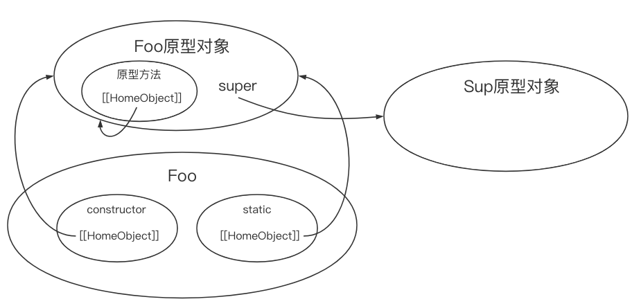

#  类基础

```js
// 类声明
class Person {}

// 类表达式
const Animal = class {};
```

类在声明之前如果被调用了就会报错

```js
console.log(ClassDeclaration); // ReferenceError: ClassDeclaration is not defined
class ClassDeclaration {}
console.log(ClassDeclaration); // class ClassDeclaration {}
```

类受块作用域限制

```js
{
  function FunctionDeclaration() {}
  class ClassDeclaration {}
}

console.log(FunctionDeclaration); // FunctionDeclaration() {}
console.log(ClassDeclaration); // ReferenceError: CLassDeclaration is not defined
```

**类构成**

* 构造函数方法 <可选>
* 实例方法 <可选>
* 获取函数 <可选>
* 设置函数 <可选>
* 静态类方法 <可选>

```js
class Foo {
  // 静态方法
  static Qux() {}
  
  // 构造函数
  constructor() {}
  
  // 获取函数
  get myBaz() {}
}
```

*类表达式名称*

```js
const Person = class PersonName {
  identify() {
    console.log(Person.name, PersonName.name);
  }
}

const p = new Person;
p.identify();	// PersonName PersonName

console.log(Person.name); // PersonName
console.log(PersonName); // ReferrenceError: PersonName is not defined
```


## 类构造函数

`constructor` 告诉解释器在使用 `new` 操作符创建类的新实例时应该调用这个函数。不显示定义构造函数时相当于将构造函数定义为空函数。

**实例化**

使用 `new` 调用类的构造函数会执行如下操作：

1. 在内存中创建一个新对象
2. 这个新对象内部的 [[prototype]] 指针被赋值为构造函数的 prototype 属性 ( 类的原型对象 )
3. 构造函数内部的 this 被赋值为这个新对象 ( 即 this 指向新对象 )
4. 执行构造函数内部的代码 ( 给新对象添加属性 )
5. 如果构造函数返回非空对象，返回这个对象; 否则，返回刚创建的新对象

```js
class Animal {}

class Person {
  constructor() {
    console.log('person ctor');
  }
}

class Vegetable {
  constructor() {
    this.color = 'orange';
  }
}

const a = new Animal();
const p = new Person(); // person ctor
const v = new Vegetable();

console.log(v.color); // orange
```

在实例化时传入的参数会被用作构造函数的参数。如果不需要参数，则类名后面的括号是可选的

```js
class Person {
  constructor(name) {
    console.log(arguments.length);
    this.name = name;
  }
}

const p1 = new Person; // 0
console.log(p1.name); // null

const p2 = new Person(); // 0
console.log(p1.name); // null

const p3 = new Person('hh'); // 1
console.log(p1.name); // hh
```

默认情况下，类构造函数会在执行之后返回 this 对象，其会被用作实例化的对象。不过如果返回的是其他对象，那该对象不会通过 instanceof 操作符检测出跟类有关联，因为这个其他对象的原型指针并没有被修改(除非自己手动修改)。

```js
class Person {
  constructor(override) {
    this.foo = 'foo';
    if (override) {
      return {
        bar: 'bar'
      };
    }
  }
}

const p1 = new Person(), p2 = new Person(true);

console.log(p1); // Person{ foo: 'foo' }
console.log(p1 instanceof Person); // true

console.log(p2); // { bar: 'bar' }
console.log(p2 instanceof Person); // false
```

类构造函数必须使用 `new` 操作符。而普通构造函数如果不使用 `new` ，则以全局 this (通常是 window) 作为内部对象。调用类构造函数时如果不使用 new 则会抛出错误。

```js
function Person() {}

class Animal {}

// 把 window 作为 this 来构建实例
const p = Person();

const a = Animal(); // TypeError: class constructor Animal cannot be invoked without 'new'
```

**类是一种特殊函数**

```js
class Person {}

console.log(typeof Person); // function
console.log(Person.prototype); // { constructor: f() }
console.log(Person === Person.prototype.constructor); // true

const p = new Person();
console.log(p instanceof Person); // true

// 类中定义的 constructor 方法不会被当成构造函数
console.log(p instanceof Person.constructor); // false
```

和普通函数一样，类可以立即实例化。由于是一个类表达式，因此类名是可选的

```js
const p = new class Person {
  consturctor(name) {
		console.log(name);
  }
}('hh'); // hh

console.log(p); // Foo {}
```


## 实例、原型和类成员

**实例**

每个实例对应一个唯一的成员对象，所有成员都不会在原型上共享。

```js
class Person {
  constructor() {
    this.name = new String('hh');
    this.sayName = () => {};
  }
}

const p1 = new Person, p2 = new Person;

console.log(p1.name === p2.name); // false
console.log(p1.sayName === p2.sayName); // false
```


**原型方法和访问器**

在类块中定义的方法是原型方法，其可以在实例间共享

```js
class Person {
  constructor() {
    // 添加到 this 的所有内容都会存在于不同的实例上
    this.locate = () => console.log('instance');
  }
  
  // 在类块中定义的所有内容都会定义在类的原型上
  locate() {
    console.log('prototype');
  }
}
```

类方法等同于对象属性，因此可以使用字符串、符号或计算的值作为键

```js
const symbolKey = Symbol('symbolKey');

class Person {
  stringKey() {
    console.log('invoked stringKey');
  }
  
  [symbolKey]() {
    console.log('invoked symbolKey');
  }
  
  ['computed' + 'Key']() {
    console.log('invoked computedKey');
  }
}

const p = new Person;

p.stringKey(); // invoked stringKey
p[symbolKey](); // invoked symbolKey
p.computedKey(); // invoked computedKey
```

**获取和设置访问器**

```js
class Person {
  set name(newName) {
    this.name_ = newName;
  }
  
  get name() {
    return this.name_;
  }
}

const p = new Person;
p.name = 'hh';
console.log(p.name); // hh
```

**静态类方法**

这些方法通常用于执行不特定于实例的操作(比如说单例和工厂)，也不要求存在类的实例。

静态成员在类中使用 `static` 关键字作为前缀。在静态成员中，`this` 引用类自身。

```js
class Person {
  constructor(age) {
    // 添加到 this 的所有内容都会存在于不同的实例上
    this.age_ = age;
    this.locate = () => console.log('instance', this);
  }
  
  // 定义在类的原型对象上
  locate() {
    console.log('prototype', this);
  }
  
  // 定义在类身上
  static locate() {
    console.log('class', this);
  }
  
  // 使静态类方法非常适合作为实例工厂
  static create() {
    return new Person(Math.floor(Math.random() * 100));
  }
}
```

在类外部定义的属性是绑定在类上的属性或静态方法

```js
class Person {
  sayName() {
    console.log(`${Person.greeting} ${this.name}`)
  }
}

// 在类上定义数据成员
Person.greeting = 'My name is';
Person.sayAge = () => console.log(18);

// 在原型上定义数据成员
Person.prototype.name = 'hh';

const p = new Person;
p.sayName(); // My name is hh;
p.sayAge; // undefined
```

**迭代器和生成器**

```js
class Person {
  constructor() {
    this.names = ['aa', 'bb', 'cc'];
  }
  
  // 在原型上定义生成器方法
  *createNameIterator() {
    yield 'aa';
    yield 'bb';
  }
  
  // 在类上定义生成器方法
  static *createJobIterator() {
    yield 'Butcher';
    yield 'Hacker';
  }
  
  // 添加一个默认迭代器，将类实例变成可迭代对象
  *[Symbol.iterator]() {
    yield *this.names.entries();
  }
}

const jobIter = Person.createJobIterator();
console.log(jobIter.next().value); // Butcher
console.log(jobIter.next().value); // Hacker

const p = new Person;
const nameIter = p.createNameIterator();
console.log(nameIter.next().value); // aa
console.log(nameIter.next().value); // bb

for (const [idx, name] of p) {
  console.log(name);
}
// aa
// bb
// cc
```


# 继承

## 继承基础

使用 `extends` 继承任何拥有 [[Construct]] 和原型的对象。因此类不仅可以继承另一个类，还可以继承普通的构造函数。

```js
// 继承类
class Vehicle {}
class Bus extends Vehicle {}

const b = new Bus();
console.log(b instanceof Bus); // true
console.log(b instanceof Vehicle); // true

// 继承普通构造函数
function Person() {}
class Engineer extends Person {}

const e = new Engineer();
console.log(e instanceof Engineer); // true
console.log(e instanceof Person); // true
```

类和原型上定义的方法后都会带到派生类，this 的值会反映调用相应方法的实例或者类(new 调用的对象)。

extends 也可以在类表达式中使用

```js
const Bar = class extends Foo{}
```


## 构造函数

派生类的方法可以通过 `super` 引用它们的原型。这个方法仅能在派生类中使用，而且仅限于在 `类构造函数`、`实例方法`和`静态方法`内部使用。

在构造函数中使用 `super` 可以调用父类构造函数。

```js
class Vehicle {
  constructor() {
    this.hasEngine = true;
  }
  
  static identify() {
    console.log('vehicle');
  }
}

class Bus extends Vehicle {
  constructor() {
    // 不能在调用 super() 前引用 this,否则会抛出 ReferenceError
    
    super(); // 相当于调用 super.constructor() 此时可以给父类构造函数传参
    console.log(this instanceof Vehicle); // true
    console.log(this); // Bus { hasEngine: true }
  }
  
  static identify() {
    super.identify(); // 调用继承的类上定义的静态方法
  }
}

Bus.identify(); // vehicle

new Bus();

```


## HomeObject

类构造函数和静态方法有个内部特性 [[HomeObject]]，这是一个指向定义该方法对象的指针。

这个指针是自动赋值的，而且只能在 JS 引擎内部访问。

super 始终会定义为 [[HomeObject]]的原型。

```js
let obj = {
    method () {}
};
// obj.method.[[HomeObject]] = obj;

class Obj {
    method () {}
}
// Obj.prototype.method.[[HomeObject]] = Obj.prototype;

function func () {}
// func.[[HomeObject]] = undefined;
```

```js
class Sup {
    method () {
        console.log('Sup method called');
    }
}

class Sub extends Sup {
    method () {
        console.log('Sub method called');
        super.method();
        // called as:
        // Object.getPrototypeOf(this.method.[[HomeObject]]).method.call(this);
    }
}
```



## super

* super 只能在派生类 `构造函数` 和 `静态方法` 中使用

  ```js
  class Vehicle {
    constructor() {
      super(); // SyntaxError: 'super' keyword unexpected
    }
  }
  ```

* 不能单独使用 super，要么用它调用构造函数，要么用它引用静态方法

  ```js
  class Vehicle {}
  
  class Bus extends Vehicle {
    constructor() {
      console.log(super); // Syntax Error: 'super' keyword unexpected here
    }
  }
  ```

* 调用 super() 会调用父类构造函数并将返回实例赋值给 this

  ```js
  class Vehicle {}
  
  class Bus extends Vehicle {
    constructor() {
      super();
      
      console.log(this instanceof Vehicle);
    }
  }
  
  new Bus(); // true
  ```

* super() 的行为如同调用构造函数，此时可以给父类构造函数传参

  ```js
  class Vehicle {
    constructor(licensePlate) {
      this.licensePlate = licensePlate;
    }
  }
  
  class Bus extends Vehicle {
    constructor(licensePlate) {
      super(licensePlate);
    }
  }
  
  console.log(new Bus('aa')); // Bus { licensePlate: 'aa' }
  ```

* 派生类没有显式定义构造函数时，在 new 派生类时会把参数直接传给父类的 constructor

  ```js
  class Vehicle {
    constructor(licensePlate) {
      this.licensePlate = licensePlate;
    }
  }
  
  class Bus extends Vehicle {}
  
  console.log(new Bus('aa')); // Bus { licensePlate: 'aa' }
  ```

* 在类构造函数中，不能在 super() 前使用 this

* 如果派生类显式定义了构造函数，则要么必须在其中调用 super()，要么必须在其中返回一个对象

  ```js
  class Vehicle {}
  
  class Car extends Vehicle {}
  
  class Bus extends Vehicle {
    constructor() {
      super();
    }
  }
  
  class Van extends Vehicle {
    constructor() {
      return {}; // 这种做法相当于和父类断绝关系
    }
  }
  
  console.log(new Car()); // Car {}
  console.log(new BUs()); // Bus {}
  console.log(new Van()); // {}
  ```


## 抽象基类

JS 没有天然提供抽象基类的语法，但是可以通过 `new.target` 来实现。

`new.target` 指向 new 调用的类或构造函数。

开发者可以在构造函数中来检测 `new.target` 是不是指向抽象基类，如果是则组织对抽象基类的实例化。

```js
// 抽象基类
class Vehicle {
  constructor() {
    console.log(new.target);
    if (new.target === Vehicle) {
      throw new Error('Vehicle cannot be directly instantiated');
    }
  }
}

// 派生类
class Bus extends Vehicle {}

new Bus(); // class Bus {}
new Vehicle(); // class Vehicle {}
// Error: Vehicle cannot be directly instantiated
```

可以看到抽象基类还是有返回新对象，只是在主线程中报错了阻止了程序的运行

我们还可以在抽象基类的构造函数中进行检查，要求派生类必须定义某个方法。因为原型方法再调用类构造函数之前已经存在了，所以可以通过 this 来检查相应的方法

```js
// 抽象基类
class Vehicle {
  constructor() {
    console.log(new.target);
    if (new.target === Vehicle) {
      throw new Error('Vehicle cannot be directly instantiated');
    }
    
    // 要求派生类必须实现的方法
    if (!this.foo) {
      throw new Error('Inheriting class must define foo()');
    }
    
    console.log('success');
  }
}

// 派生类
class Bus extends Vehicle {
  foo() {}
}

// 派生类
class Van extends Vehicle {}

new Bus(); // success
new Van(); // Error: Inheriting class must define foo()
```


## 扩展内置类型

```js
class SuperArray extends Array {
  shuffle() {
    for (let i = this.length - 1; i > 0; i--) {
      const j = Math.floor(Math.random() * (i + 1));
      [this[i], this[j]] = [this[j], this[i]];
    }
    return this;
  }
}

const a = new SuperArray([1, 2, 3]);
console.log(a instanceof SuperArray); // true
console.log(a instanceof Array); // true

console.log(a); // [1, 2, 3]
a.shuffle(); // [2, 3, 1]
```

有些内置类型的方法会返回新实例。默认情况下，返回实例类型和原始实例类型一致

```js
class SuperArray extends Array {
  shuffle() {
    for (let i = this.length - 1; i > 0; i--) {
      const j = Math.floor(Math.random() * (i + 1));
      [this[i], this[j]] = [this[j], this[i]];
    }
    return this;
  }
}

const a = new SuperArray([1, 2, 3]);
const b = a.filter(x => x % 2);

console.log(a instanceof SuperArray); // true
console.log(b instanceof SuperArray); // true
```

开发者可以通过 Symbol.species 访问器决定在创建返回的实例时使用的类

```js
class SuperArray extends Array {
  static get [Symbol.species]() {
    return Array;
  }
}

const a = new SuperArray([1, 2, 3]);
const b = a.filter(x => x % 2);

console.log(a instanceof SuperArray); // true
console.log(b instanceof SuperArray); // false
```


## 混入

JS 同样没有对混入有天然的语法支持，但是可以通过 `Object.assign()` 来实现。

```js
class Vehicle {}

const FooMixin = (SuperClass) => class extends SuperClass {
  foo() {
    console.log('foo');
  }
}

const BarMixin = (SuperClass) => class extends SuperClass {
  bar() {
    console.log('bar');
  }
}

class Bus extends FooMixin(BarMixin(Vehicle)) {}

const b = new Bus();

b.foo(); // foo
b.bar(); // bar
```

可以用一个辅助函数来优化上述过程

```js
class Vehicle {}

const FooMixin = (SuperClass) => class extends SuperClass {
  foo() {
    console.log('foo');
  }
}

const BarMixin = (SuperClass) => class extends SuperClass {
  bar() {
    console.log('bar');
  }
}

function mix(BaseClass, ...Mixinx) {
  return Mixins.reduce((pre, cur) => current(pre), BaseClass);
}

class Bus extends mix(Vehicle, FooMixin, BarMixin) {}

const b = new Bus();

b.foo(); // foo
b.bar(); // bar
```

**值得注意的是，在平时开发中：组合要胜过继承 (composition over inheritance)**


